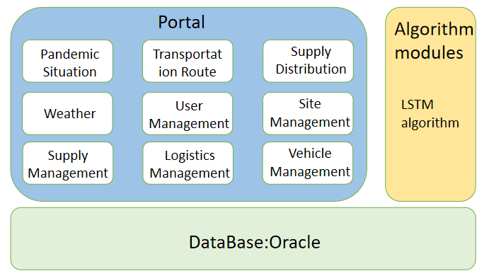
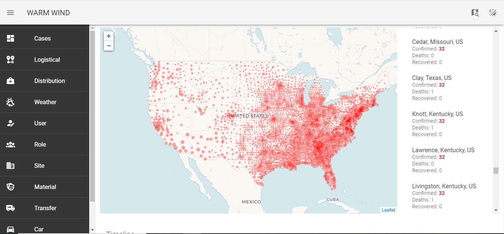
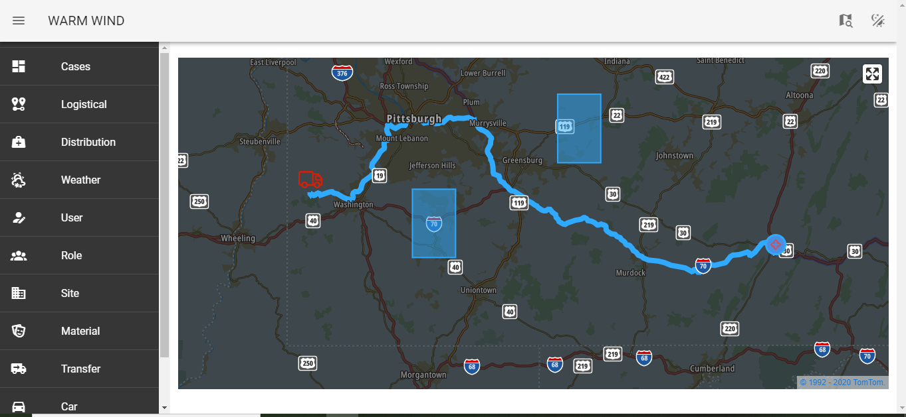
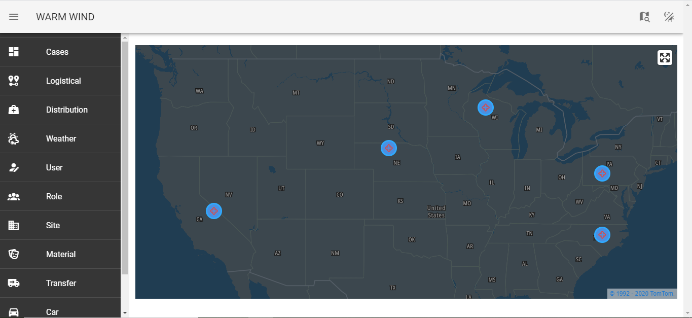
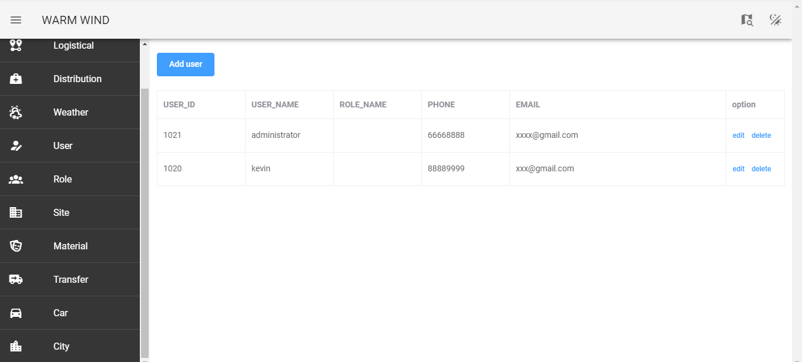
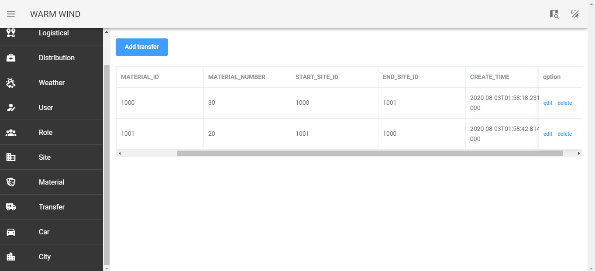

# WARM WIND

A. Project Description:
The WarmWind team has been working on a method to deliver supplies to those in need in a quick and efficient manner, while also minimizing the risk of collection personnel being infected. WarmWind's deployment address on IBM Kubernetes:http://184.173.5.45:30875/icbc/hzyjs/index.html

B. Function Module Description
The WarmWind project primarily consists of the Portal and Algorithm modules.

1. The Portal module includes functions such as pandemic situation, supply transportation, supply distribution, weather, user management, role management, site management, supply management, transportation management, and vehicle management.
    
    Pandemic Situation: this module synchronizes the latest daily COVID-19 pandemic data (https://github.com/CSSEGISandData/COVID-19/tree/master/csse_covid_19_data/csse_covid_19_daily_reports) in real-time. This data includes newly diagnosed cases by city, recoveries, and total diagnoses. The module will also display anti-pandemic government policy and regulation information in real time to help keep users abreast of the changing ever-changing landscape.
    
    
    
    Transportation Route: this module provides an optimal route for the transportation of supplies based on the start location, end location, pandemic situation of areas on the route, and traffic situation. 
    
    
    
    Supply Distribution: by predicting pandemic trends with a time series algorithm, this module selects areas with low projected spread as points of delivery, ensuring supply and route safety throughout the pandemic.
    
    
    
    Weather: this module collects real-time weather data from various locations and displays them in a frontend interface to provide a reference for the selection of supply distribution routes and locations.
    
    User Management: this module can be used to manage the basic user data of site managers and transportation personnel.
    
    
    
    Role Management: this module can be used to manage the basic role data of site managers and transportation personnel.
    
    Site Management: this module can be used to manage the basic data of supply storage and distribution sites.
    
    Supply Management: this module can be used to manage the basic data of donated and purchased supplies by organization.
    
    Logistics Management: this module can be used to manage vehicles, transport personnel, transported supplies, and the start and end locations of each transportation process.
    
    
    
    Vehicle Management: this module can be used to manage vehicles by site, vehicle drivers, and the current location and transportation status of each vehicle.
    
2. The Algorithm module primarily predicts future pandemic trends in accordance with the specific situation of each region. It is important to avoid areas with high pandemic spread projections in route and delivery location selection. Taking into account the regional pandemic situation, an optimal delivery location is calculated through an LSTM algorithm to reduce infection risk to personnel and ensure delivery of supplies.

C. Deployment Instructions
  This project uses Springboot architecture for backend development, Vue.js for frontend development, Python for algorithm module implementation, and the Oracle Database for data storage. The service can be mirrored through the IBM Cloud Kubernetes Panel.
  Oracle database mirror address: us.icr.io/warmwind/kevin:202007301502
  WarmWind Web mirror address: us.icr.io/warmwind-java/warmwind:202007311637